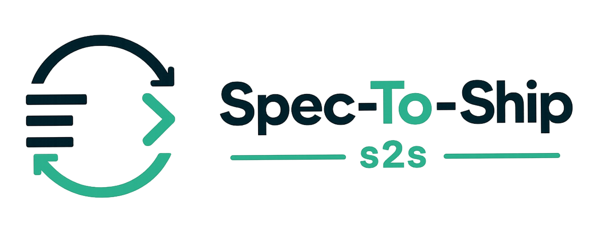

<p align="center">
  
</p>

<p align="center">
  <a href="https://github.com/guschiriboga/spec-to-ship/actions/workflows/ci.yml"></a>
  <a href="https://www.npmjs.com/package/spec-to-ship"></a>
  <a href="https://github.com/KiniunCorp/spec-to-ship/stargazers"></a>
  <a href="./LICENSE"></a>
</p>

<p align="center">
  <a href="#why-s2s">Why s2s</a> · <a href="#how-it-works">How it works</a> · <a href="#install">Install</a> · <a href="#quick-start">Quick start</a> · <a href="#stages">Stages</a> · <a href="#command-reference">Commands</a> · <a href="#documentation">Docs</a>
</p>

[DEMO - Full s2s workflow](https://github.com/user-attachments/assets/d944be06-762d-44ec-ab32-fd8587753694)

# Spec-To-Ship (`s2s`)

`s2s` gives your AI chat sessions a structured engineering workflow. Every request is classified, routed through the right stages, tracked end-to-end, and gated for your approval — while your AI chat client does the actual work.

Works with **Claude Code, Codex, OpenCode**, and any AI chat tool that reads file-based governance. No lock-in.

## Why s2s

AI chat tools are powerful — but a raw chat session has no memory, no process, and no guardrails. Without structure:

- Work that needs design gets coded before it's understood
- Bug fixes skip the spec and introduce new bugs
- Every session starts from scratch — no state, no audit trail
- Code runs without a human ever seeing the plan

`s2s` wraps your existing chat client with a lightweight process layer. The right stages run in the right order. Nothing over-engineers. Nothing skips required steps. You approve before any code executes.

## How it works

`s2s` is chat-native. You don't run it directly — your AI chat client does, automatically.

When you run `s2s init` in a project, it installs governance files that your chat client reads at the start of every session. From then on, when you give your AI a task, it calls `s2s request` to classify the intent, selects the minimum stages needed, and works through each stage using focused task packages — all inside the chat session.

```
You:  "add rate limiting to the API"

AI:   s2s request "add rate limiting to the API"
      → intent: new_feature  ·  route: pm → engineering → engineering_exec

AI:   s2s stage pm
      ← task: write PRD.md scoped to rate limiting
      [generates PRD.md in the chat session]
      s2s stage pm --submit
      → quality passed  ·  next: engineering

AI:   s2s stage engineering
      ← task: write TechSpec.md + Backlog.md
      [generates specs in the chat session]
      s2s stage engineering --submit
      → approval gate created  ·  waiting for: s2s approve <id>

You:  s2s approve <id>
      → engineering_exec begins in an isolated git worktree
```

The orchestrator decides the route based on what you asked for. **A bug fix goes straight to engineering. A new feature routes through product, design, and engineering. A research question runs investigation only.** Nothing over-engineers, nothing skips required steps.

You approve before any code runs. Changes happen in an isolated git worktree — your main branch is untouched until you review and merge.

<p align="center">
  
</p>

## When to use s2s

| Scenario | Without s2s | With s2s |
|---|---|---|
| **New feature** | Chat → code → hope | PM → design → engineering → approve → exec |
| **Bug fix** | Describe bug, get patch | Classified as bug fix, straight to engineering spec + exec |
| **Research spike** | Open-ended back-and-forth | Scoped research stage, structured Research.md output |
| **Refactor** | Risky, no plan | Engineering spec first, isolated worktree execution |
| **Question / explanation** | One-off answer, lost to chat history | Stored and queryable, traceable to the change that caused it |

## Install

**npm (all platforms):**

```bash
npm install -g spec-to-ship
```

**Homebrew (macOS):**

```bash
brew tap kiniuncorp/s2s
brew install s2s
```

To upgrade: `brew upgrade s2s`

**From source:**

```bash
git clone https://github.com/KiniunCorp/spec-to-ship.git
cd spec-to-ship
npm install && npm run build && npm link
```

## Quick start

```bash
cd /path/to/your-project
s2s init
```

<p align="center">
  
</p>

Verify everything is ready:

```bash
s2s doctor
```

<p align="center">
  
</p>

**Done.** `s2s init` has just installed a structured engineering process into your project — governance files, stage definitions, and approval gates, all in `.s2s/`.

<p align="center">
  
</p>

> [!IMPORTANT]
> **Open your AI chat client in this directory and give it a task — exactly as you normally would.**
>
> From this point on, every request gets classified, routed through the right stages, and gated for your approval before any code runs. Automatically. Every session.

## Supported chat clients

`s2s` is client-agnostic. It works with any AI tool that reads file-based governance at session start.

| Client | Reads automatically |
|---|---|
| **Claude Code** | `CLAUDE.md` + `.s2s/guardrails/CLAUDE.md` |
| **Codex** | `CODEX.md` + `.s2s/guardrails/CODEX.md` |
| **OpenCode** | `AGENTS.md` + `.s2s/guardrails/AGENTS.md` |
| **Any other client** | Point your client to read `AGENTS.md` at session start |

## What s2s manages

- **Intent classification** — 9 intent types; selects the minimum stages each request actually needs
- **Persistent state** — every change, spec, decision, and gate stored across sessions and queryable
- **Quality validation** — artifact checks before any stage advances
- **Approval gates** — human review required before code executes; nothing runs unattended
- **Isolated execution** — code changes run in a dedicated git worktree, never in your live directory
- **Audit trail** — full record of what was requested, how it was routed, what was built, and who approved

## Stages

| Stage | Output |
|---|---|
| `pm` | `PRD.md` — product requirements |
| `research` | `Research.md` — technical investigation |
| `design` | `PrototypeSpec.md` — interface and architecture |
| `engineering` | `TechSpec.md`, `Backlog.md` — implementation plan |
| `engineering_exec` | code changes, verification, git branch and PR |

## Command reference

These commands are called by your AI client during a session. You can also run them directly.

```
s2s                              # project status and next action
s2s init [path]                  # initialize or repair .s2s in a project
s2s request "<prompt>"           # classify intent and plan the work route
s2s stage <stage>                # emit task package for a stage
s2s stage <stage> --submit       # validate artifact and advance the workflow
s2s approve <gateId>             # approve a pending gate
s2s reject <gateId>              # reject a pending gate
s2s status                       # full project state: changes, specs, gates, slices
s2s doctor                       # validate governance, config, and chat readiness
s2s update                       # refresh .s2s files to current CLI version
s2s config edit                  # edit project configuration interactively
s2s backup / restore             # snapshot and restore .s2s state
s2s help [topic]                 # per-command help
```

<p align="center">
  
</p>

## Documentation

- [User Manual (EN)](./docs/user-manual_en.md) / [Manual de Usuario (ES)](./docs/user-manual_es.md)
- [Chat-Native Workflow (EN)](./docs/chat-native-workflow_en.md) / [Flujo Chat-Native (ES)](./docs/chat-native-workflow_es.md)
- [Technical Architecture (EN)](./docs/technical-architecture_en.md) / [Arquitectura Técnica (ES)](./docs/technical-architecture_es.md)
- [Technical Operations and Security (EN)](./docs/technical-operations-security_en.md) / [Operación Técnica y Seguridad (ES)](./docs/technical-operations-security_es.md)
- [Backup and Restore (EN)](./docs/backup-and-restore_en.md) / [Backup y Restore (ES)](./docs/backup-and-restore_es.md)
- [Versioning and Migrations (EN)](./docs/versioning-and-migrations_en.md) / [Versionado y Migraciones (ES)](./docs/versioning-and-migrations_es.md)
- [Homebrew Distribution (EN)](./docs/homebrew-distribution_en.md) / [Distribución Homebrew (ES)](./docs/homebrew-distribution_es.md)
- [Documentation Map (EN)](./docs/documentation-map_en.md) / [Mapa de Documentación (ES)](./docs/documentation-map_es.md)

## Development

```bash
npm install
npm run check          # full release gate (typecheck + build + 30 contract tests)
npm run cli -- --help  # run from source
```

Every change goes on its own branch and merges to `main` via PR. See [Versioning and Migrations](./docs/versioning-and-migrations_en.md) for the version bump policy.

## Contributing

Contributions are welcome. Please open an issue before submitting a PR for non-trivial changes. Run `npm run check` before submitting — all checks must pass. See [CONTRIBUTING.md](./CONTRIBUTING.md) for the full workflow.

## License

[MIT](./LICENSE)
